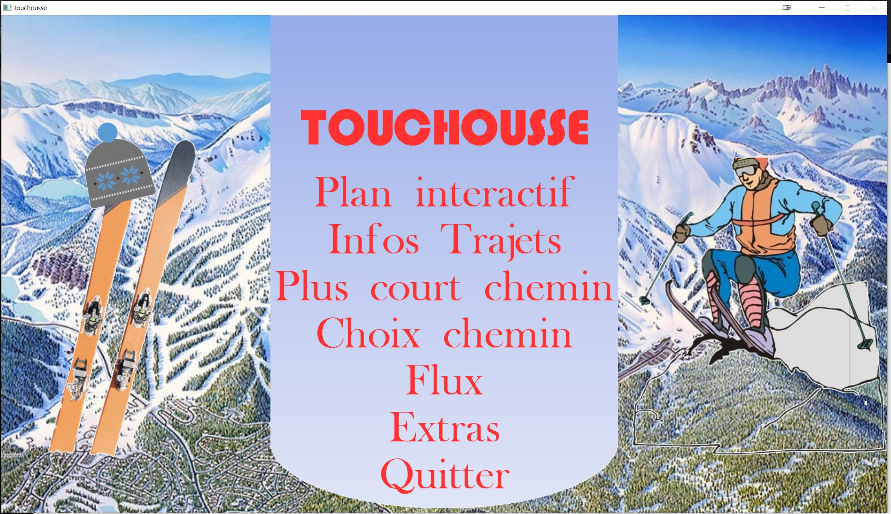
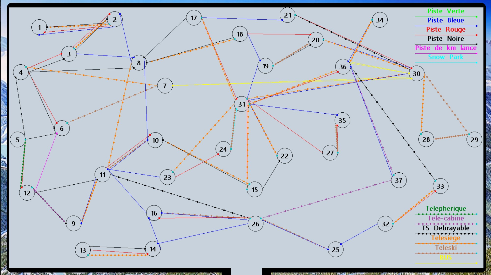
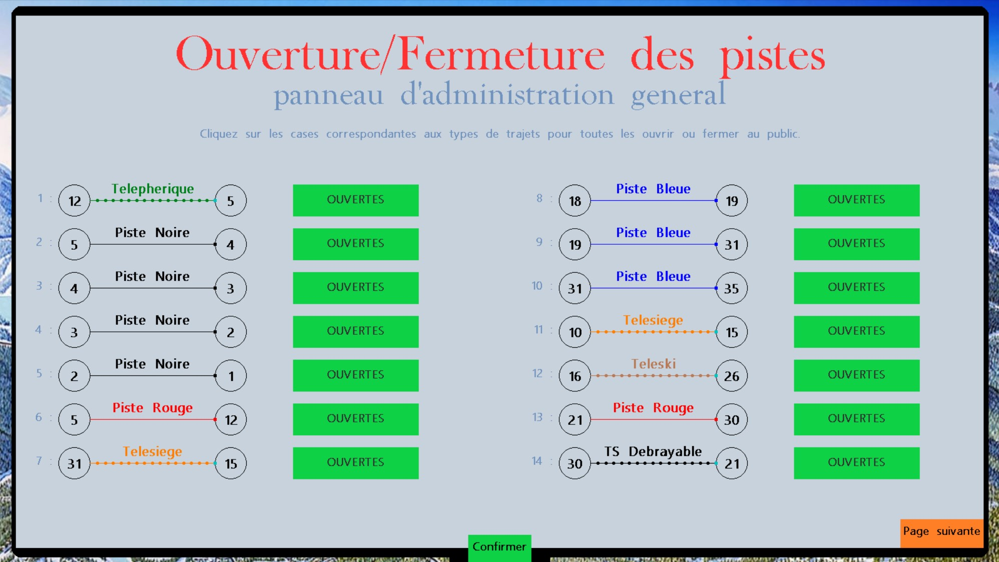

# Touchousse

Projet du premier semestre de deuxième année à l'ECE en Théorie des Graphes.

Application d'orientation d'un utilisateur dans la station de ski des Arcs.

## A propos

Il s'agit d'une application permettant aux visiteurs de s'orienter et de trouver les meilleurs chemins pour arriver à une destination dans la station des Arcs. Il est développé en **C++** avec la bibliothèque graphique primitive **Allegro**.

## Cahier des charges

Le cahier des charges est disponible [ici](CahierDesCharges.pdf).

### Résumé du cahier des charges

- Calculer les temps de trajets entre deux points de la station
- Implémenter une interface simple d’aide en mode console à l'utilisateur permettant :
  - En choisissant un trajet (piste ou remontée ou entre 2 arrêts de bus), de savoir d'où il part et où il arrive
  - En choisissant un point, de savoir les trajets qui en partent et qui permettent d’y arriver
- Implémenter un algorithme déterminant, à partir d'un point de départ, tous les plus courts chemins issus de ce point ainsi que leurs temps
- Implémenter un algorithme qui affiche en mode console l’itinéraire le plus rapide entre deux points sur la borne interactive.
- Implémenter un système de choix de trajet par intérêt (un skieur moyen peut ne pas vouloir s'embarquer sur des pistes noires, certains ont peur des télésièges etc)

Extensions proposées :

- Ajouter la notion de débit de trafic sur les pistes et les remontées mécaniques à l'application et implémenter un algorithme de résolution des flots maximums
- Interface graphique avec la bibliothèque graphique **Allegro**
- Utilisation de Git pour le versionning

### Travail réalisé

Nous avons réalisé toutes les fonctionnalités mentionnées précédemment, ainsi que les extensions proposées.

De plus, nous avons implémenté les foncionnalités supplémentaires suivantes :

- Création de comptes administrateurs
- Un panneau d’administrateur pour permettre à un administrateur d'ovrir ou de fermer une piste ou une remontée mécanique, impactant ainsi directement les trajets proposés par l'application
- La sauvegarde des données dans un fichier texte (notamment les administrateurs et l'état des pistes et remontées mécaniques)

## Ce que nous avons appris

- Première utilisation de Git pour le versionning
- Progression en programmation graphique

## Installation

- [**CodeBlocks** 20.03](http://www.codeblocks.org/downloads/26)
- **Allegro** 4.4.3, [guide d'installation par M. Fercoq](https://fercoq.bitbucket.io/allegro/distribution/tuto_installer_allegro_64.pdf)

## Contributeurs

- Adrien Blair [@Ahddry](https://github.com/Ahddry)
- Cyril Haubois [@teepol](https://github.com/teepol)

## Copyright

Ce projet est sous licence MIT.

> Pour les étudiants, citez-nous si vous souhaitez réutiliser ce projet dans le cadre de vos propres travaux, ca vous évitera de vous faire prendre pour plagiat.

## Captures d'écran supplémentaires

> En cas de problème de lancement de l'application et que celle-ci retourne le message d'erreur "prb gfx mode", commenter la ligne 35 de Plan_Pistes.cpp et retirer la marque de commentaire sur la 33. Cela aura pour effet de mettre l'application en plein écran et de potentielement déformer les positions de certains objets affichés. Ceci est un problème lié à allegro, qui a principalement effet lorsque l'application est lancé sur un écran avec une résolution trop basse.
